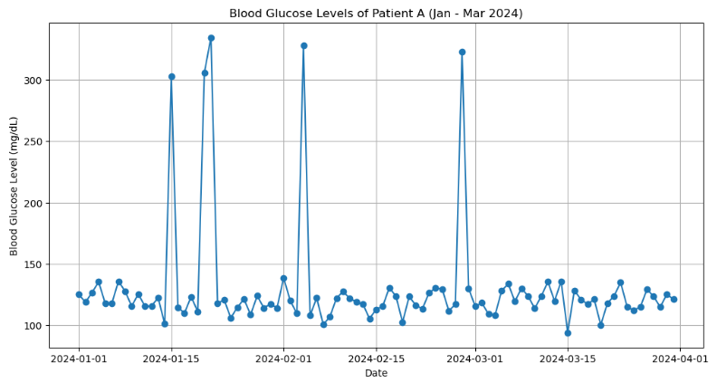

# Project10-EDA-Outlier-Detection-In-Blood-Sugar-Level
Detecting outliers in line chart to determine Blood Sugar spikes
# Outlier Detection In Blood Sugar Level
> **Brief Description:** - Detecting outliers in line chart to determine Blood Sugar spikes


---

## Table of Contents

- [Description](#description)
- [Video Explanation](#video)
- [Technologies Used](#technologies-used)
- [Dataset](#dataset)
- [Program Codes ](#program-codes)
- [Screenshots](#screenshots)
- [Contribution](#contributipn)
- [Contact Details](#contact-details)

---

## Description

A case study on monitoring and analyzing blood glucose levels in diabetic patients. We will focus on Patient A, whose data spans from January to March 2024. Here we will study the pattent in the blood glucose level by looking at a line chart showing fluctuations in the readings that has been recorded during this period.

## Video

[](https://www.youtube.com/watch?v=xH7QeJPWEj8) 

## Technologies-used

Python programming language, pandas, folium, IPython and geopandas package.

## Dataset

The dataset has been generated by another program. However, it is recommended that for real life analysis actual data should be collected and processed properly to get realistic results.

```python
import pandas as pd
import matplotlib.pyplot as plt
import numpy as np

# Sample data for demonstration
dates = pd.date_range(start='2024-01-01', end='2024-03-31')
num_days = len(dates)

# Generate realistic glucose levels with natural variations
np.random.seed(42)
base_glucose = 120 + np.random.normal(0, 10, num_days)
# Add occasional high spikes to simulate outliers
spikes = np.random.choice([0, 0, 0, 0, 200], num_days, p=[0.90, 0.01, 0.01, 0.01, 0.07])
glucose_levels = base_glucose + spikes
```

## Program-codes

```python
import pandas as pd
import matplotlib.pyplot as plt
import numpy as np

# Sample data for demonstration
dates = pd.date_range(start='2024-01-01', end='2024-03-31')
num_days = len(dates)

# Generate realistic glucose levels with natural variations
np.random.seed(42)
base_glucose = 120 + np.random.normal(0, 10, num_days)
# Add occasional high spikes to simulate outliers
spikes = np.random.choice([0, 0, 0, 0, 200], num_days, p=[0.90, 0.01, 0.01, 0.01, 0.07])
glucose_levels = base_glucose + spikes

# Creating the DataFrame
data = pd.DataFrame({
    'Date': dates,
    'Blood Glucose Level (mg/dL)': glucose_levels
})


# Plotting the data
plt.figure(figsize=(12, 6))
plt.plot(data['Date'], data['Blood Glucose Level (mg/dL)'], marker='o', linestyle='-')
plt.title('Blood Glucose Levels of Patient A (Jan - Mar 2024)')
plt.xlabel('Date')
plt.ylabel('Blood Glucose Level (mg/dL)')
plt.grid(True)
plt.show()
```

The programs are written on jupiter notebook, You may run the program on Google colab by clicking on the colab badge below. However, the output may not be generated on colab. For that you have to download the program and run it locally. Make sure that the packages are all installed.

[](https://colab.research.google.com/github/fromsantanu/Project10-EDA-Outlier-Detection-In-Blood-Sugar-Level/blob/main/Project10-EDA-Outlier-Detection-In-Blood-Sugar-Level.ipynb)

## Screenshots



## Interpretation of the chart

- The plot of blood glucose levels for Patient A from January to March 2024 shows an overall stable trend with regular fluctuations around the baseline of approximately 140 mg/dL. 
- Most data points fall within the range of 100 mg/dL to 160 mg/dL, indicating that the patient's blood glucose levels are generally well-controlled on a daily basis. 
- These minor variations are expected and likely influenced by daily activities, meals, and medication adherence.
- However, there are several significant outliers observed in mid-January and early February, with glucose levels spiking to over 300 mg/dL. 
- These spikes represent episodes of severe hyperglycemia, which are concerning and require immediate medical attention. -
- Identifying the causes of these outliers is crucial, as they could be related to dietary habits, missed medication, stress, or other factors. 
- Continuous monitoring and consultation with healthcare providers are recommended to adjust the treatment plan and prevent future hyperglycemic events, ensuring better overall management of the patient's condition.

## Contribution

The programs are written by Santanu Karmakar

## Contact-details

If you wish to contact me, please leave a message (Preferably WhatsApp) on this number: 6291 894 897.
Please also mention why you are contacting me. Include your name and necessary details.
Thank you for taking an interest.
